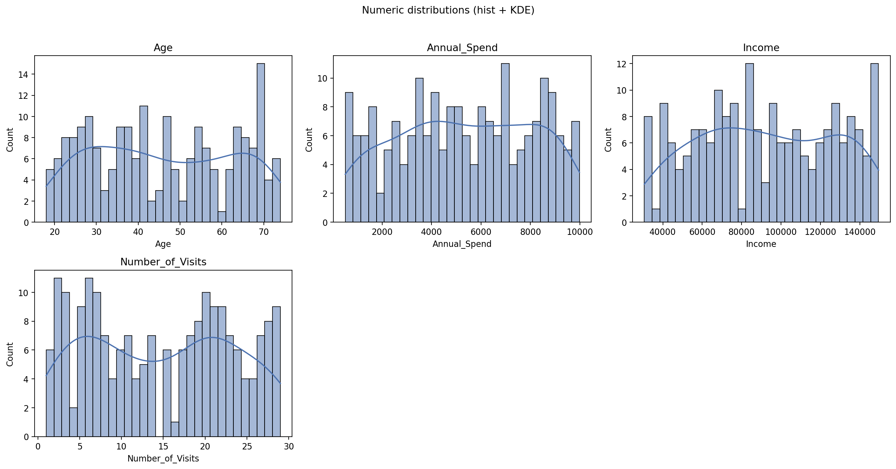
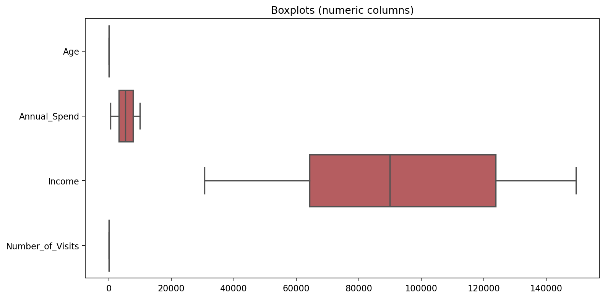
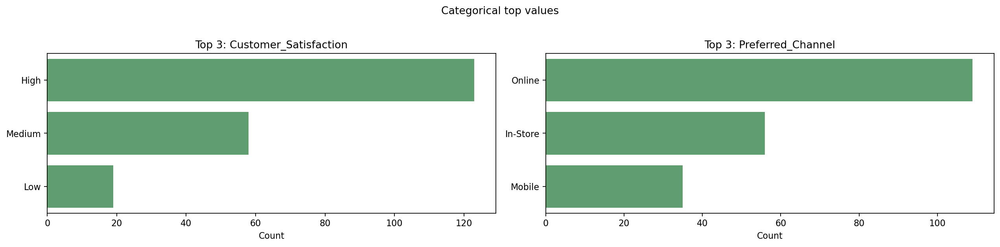
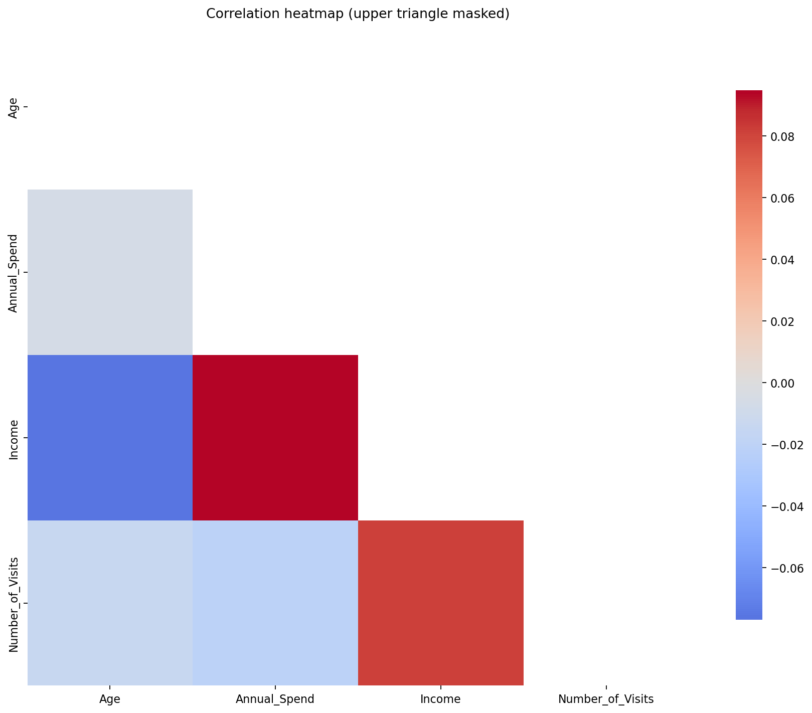
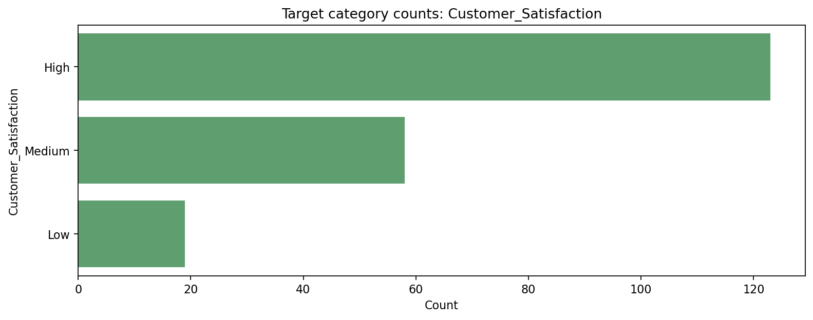
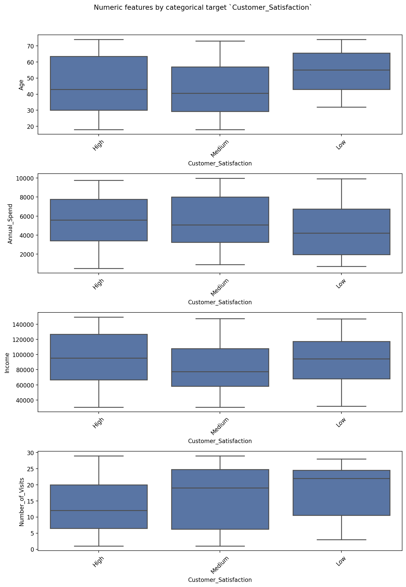

# Example EDA Report — sales_and_customers

This report is generated by **EDA LLM Assistant**: exploratory analysis for tabular data, 
with explicit notes on **which methods** are used and **how** they are applied.

## Report output (how to read this document)

- **Input data source** (from config): `sales_and_customers.csv`
- **Sections** follow: dictionary → **column intelligence** → structure → validation → transformations → visualizations → **supervised (if target set)** → other notes → provenance.
- **Plots** are embedded as relative paths under the output folder.
- Method notes appear as blockquotes (lines starting with `>`) under each subsection.

## 1. Data dictionary

> We build a **data dictionary** table for every column: dtype, distinct count, missing rate, an **inferred meaning** from name patterns (token heuristics, not domain truth), and whether the column is treated as a candidate **independent** variable or the configured **target**. You can override any column with `dictionary:` in the YAML config (column name → definition).

| column                | dtype   |   n_unique |   missing_pct | in_analysis   | meaning                                                                             | role_in_eda                                  |
|:----------------------|:--------|-----------:|--------------:|:--------------|:------------------------------------------------------------------------------------|:---------------------------------------------|
| CustomerID            | int64   |        200 |             0 | no            | Inferred: likely Identifier (surrogate or business key) (from column name pattern). | excluded from analysis (identifier / manual) |
| Age                   | int64   |         55 |             0 | yes           | Inferred: likely Age or aging-related measure (from column name pattern).           | numeric (candidate independent)              |
| Income                | int64   |        199 |             0 | yes           | Inferred: likely Monetary amount or income (from column name pattern).              | numeric (candidate independent)              |
| Annual_Spend          | float64 |        200 |             0 | yes           | Inferred: likely Monetary amount or income (from column name pattern).              | numeric (candidate independent)              |
| Number_of_Visits      | int64   |         29 |             0 | yes           | Inferred: likely Count or numeric quantity (from column name pattern).              | numeric (candidate independent)              |
| Preferred_Channel     | object  |          3 |             0 | yes           | Inferred: likely Channel or source category (from column name pattern).             | categorical (candidate independent)          |
| Customer_Satisfaction | object  |          3 |             0 | yes           | Inferred: likely Score or satisfaction level (from column name pattern).            | dependent (target)                           |

*If inferred meanings are wrong, replace them in config under `dictionary:` or in your organization’s official data dictionary.*

## 2. Column intelligence

> **Column intelligence (heuristic).** We label each loaded column with a **semantic guess** (money-like, count-like, high-cardinality text, etc.) using **dtype**, **name tokens**, and **cardinality**. Separately, on **string** columns we scan a sample for **PII-like patterns** (email, phone, SSN-shaped strings, Luhn-passing digit strings that may resemble payment cards). These are **screening hints**, not legal classification—expect false positives/negatives.

| column                | in_analysis   | semantic_guess                         | semantic_note                                | pii_risk_flags   | pii_scan_note   |   n_unique |   cardinality_ratio |
|:----------------------|:--------------|:---------------------------------------|:---------------------------------------------|:-----------------|:----------------|-----------:|--------------------:|
| CustomerID            | no            | surrogate_or_manual_excluded           | Column excluded from analysis (often an ID). | none             |                 |        200 |               1     |
| Age                   | yes           | continuous_or_count_numeric            | Generic numeric; inspect domain.             | none             |                 |         55 |               0.275 |
| Income                | yes           | monetary_like                          | Name suggests money; verify currency/units.  | none             |                 |        199 |               0.995 |
| Annual_Spend          | yes           | monetary_like                          | Name suggests money; verify currency/units.  | none             |                 |        200 |               1     |
| Number_of_Visits      | yes           | count_like_integer                     | Integer with count-like name.                | none             |                 |         29 |               0.145 |
| Preferred_Channel     | yes           | nominal_or_low_cardinality_categorical | Typical categorical / string labels.         | none             |                 |          3 |               0.015 |
| Customer_Satisfaction | yes           | nominal_or_low_cardinality_categorical | Typical categorical / string labels.         | none             |                 |          3 |               0.015 |

- Sample export: [`column_intelligence.csv`](column_intelligence.csv)

## 3. Data structure

> **Method — excluding identifiers from analysis.** Surrogate keys (e.g. `CustomerID`, `id`, `order_id`) are usually **not modeling features**: they inflate numeric summaries, distort correlations/outliers, and leak train/test identity if misused. By default we **drop** columns that match ID-like name patterns **before** validation plots, correlations, IQR outliers, and distributional plots. They still appear in the **data dictionary** with `in_analysis = no`. The configured `columns.target` is never auto-dropped. Disable with `columns.auto_exclude_id_columns: false` or add explicit drops with `exclude_from_analysis`.

**Excluded from statistical analysis (identifiers / manual):** `CustomerID`

### 3.1 Data summary

- **Rows (n):** 200
- **Columns (p):** 6
- **Approx. memory:** 0.03 MB (pandas `memory_usage(deep=True)`)

- Sample export: [`sample_rows.csv`](sample_rows.csv)

### 3.2 Numeric vs categorical (and other roles)

> **Method — numeric vs categorical vs datetime.** We rely on pandas dtypes after load: `select_dtypes` for numeric (`int`, `float`), boolean, `datetime64`, and object/category strings. Columns listed under `columns.datetime_columns` in the config are coerced with `pandas.to_datetime(..., errors='coerce')`, which parses valid dates and turns failures into missing (`NaT`).

| Role | Columns (count) | Names |
|---:|---:|---|
| Numeric | 4 | Age, Annual_Spend, Income, Number_of_Visits |
| Categorical (object/category) | 2 | Customer_Satisfaction, Preferred_Channel |
| Boolean | 0 | — |
| Datetime | 0 | — |

### 3.3 Dependent vs independent variables

> **Dependent vs independent variables.** The config marks **`Customer_Satisfaction`** as the **dependent (target) variable** for supervised analysis. All other analyzed columns are treated as **candidate independent variables** (predictors / features). Causal interpretation still requires study design, not EDA alone.

## 4. Data validation

### 4.1 Missing values

> **Method — missing values.** We count missing entries with `pandas.isna()` on each column (treats `NaN`/`None` and nullable types as missing). For each column we report `missing_count` and `missing_pct = missing_count / n_rows * 100`. Bar and heatmap visuals help scan which columns and rows are affected.

No missing values detected.

### 4.2 Duplicate records

> **Method — duplicate rows.** We use `DataFrame.duplicated()` with default settings (all columns, keep first occurrence as non-duplicate). The count is the number of rows that repeat an earlier row exactly.

- **Duplicate rows:** 0
- **Duplicate %:** 0.0000%

### 4.3 Anomalies / consistency (heuristic checks)

> **Method — basic error / consistency checks (heuristic).** We do not know your domain rules, so we flag:

- **Constant columns** (≤1 distinct non-null value) — often IDs wrongly typed or placeholders.
- **High missing rate** — columns above a configurable fraction of missing cells.
- **Mixed-type object columns** — sample of values converts to numeric for some but not all; may indicate dirty strings or combined formats.

These are starting points for manual or business validation, not automatic corrections.

No heuristic flags from the built-in checks (see methodology for limits).

### 4.4 Outliers (IQR fences)

> **Method — outliers (Tukey / IQR rule).** For each numeric column we compute:

- **Q1** = 25th percentile, **Q3** = 75th percentile.
- **IQR** = Q3 − Q1 (interquartile range: spread of the middle 50% of the data).
- **Lower fence** = Q1 − 1.5 × IQR, **upper fence** = Q3 + 1.5 × IQR.

Any row where the value is **below the lower fence or above the upper fence** is counted as an IQR-based outlier for that column. If IQR is 0 (or undefined), we skip flagging for that column to avoid degenerate fences. This rule is descriptive, not a claim that those points are data entry errors.

| column           |   outlier_count |   outlier_pct |
|:-----------------|----------------:|--------------:|
| Age              |               0 |             0 |
| Annual_Spend     |               0 |             0 |
| Income           |               0 |             0 |
| Number_of_Visits |               0 |             0 |

## 5. Data transformation

> **Transformations.** This report separates: (1) **applied in this run** — only what the pipeline actually changed (e.g. datetime coercion); (2) **suggested** — common next steps from skew, missingness, or cardinality (you choose whether to implement in modeling pipelines).

### 5.1 Applied in this run

- **Identifier / manual exclusion:** dropped from analysis (still in dictionary): `CustomerID`.

### 5.2 Suggested next steps (not applied automatically)

No generic transformation suggestions from heuristics, or dataset is small/simple.

## 6. Data visualization

### 6.1 Numeric distributions

> **Method — numeric summaries.** For numeric columns we use `DataFrame.describe()` with extra percentiles (e.g. 1%, 5%, 50%, 95%, 99%). That gives count, mean, std, min/max, and distribution quantiles. Skewness and kurtosis use the usual pandas `.skew()` and `.kurtosis()` on numeric columns.

> **Plots — numeric.** Histograms with KDE (`seaborn.histplot`, `kde=True`) show shape and density. Horizontal boxplots summarize quartiles and show points beyond the whiskers (useful alongside the IQR counts above).

| column           |      mean |         std |     min |      p50 |       max |
|:-----------------|----------:|------------:|--------:|---------:|----------:|
| Age              |    45.855 |    16.7324  |    18   |    45    |     74    |
| Annual_Spend     |  5338.69  |  2743.75    |   504.2 |  5269.09 |   9984.84 |
| Income           | 92201.7   | 34532.1     | 30591   | 90003.5  | 149489    |
| Number_of_Visits |    14.715 |     8.71571 |     1   |    15    |     29    |

### 6.2 Categorical distributions

> **Method — categorical top values.** For object/category columns we compute `value_counts` (including missing as its own bucket) and show the top N categories by frequency.

> **Plots — categorical.** Bar charts show the **top categories** per column (same logic as value_counts, limited to a max number of columns for readability).

#### `Customer_Satisfaction`

| value   |   count |
|:--------|--------:|
| High    |     123 |
| Medium  |      58 |
| Low     |      19 |

#### `Preferred_Channel`

| value    |   count |
|:---------|--------:|
| Online   |     109 |
| In-Store |      56 |
| Mobile   |      35 |

### 6.3 Correlations

> **Method — Pearson correlation.** For numeric columns we compute the pairwise Pearson correlation matrix with `DataFrame.corr()` (default method `pearson`). Each entry is between −1 and 1: linear association, not causation. We flag pairs with absolute correlation ≥ `report.corr_threshold` as “high” for review.

> **Plots — correlation.** The heatmap shows the Pearson matrix; the **upper triangle is masked** so each pair appears once and the diagonal is easier to scan.

No pairs with |r| ≥ threshold (edit `report.corr_threshold`; current logic uses absolute Pearson r).

## 7. Supervised / target-driven EDA

> **Supervised / target-driven EDA.** With `columns.target` set, we add tables that relate the target to other features: for a **numeric** target, group summaries and Kruskal–Wallis tests vs categoricals (nonparametric, independent groups); for a **categorical** target, numeric summaries by target level and chi-square tests vs other categoricals (independence on contingency tables). **Assumptions** are stated with each test. High-cardinality categoricals are skipped for chi-square (configurable cap) to avoid unstable tables.

**Target column:** `Customer_Satisfaction`  
**Type (for this section):** `categorical`

### 7.1 Target profile

| Customer_Satisfaction   |   count |
|:------------------------|--------:|
| High                    |     123 |
| Medium                  |      58 |
| Low                     |      19 |

#### Numeric feature `Age` by target level

| Customer_Satisfaction   |   count |    mean |   median |     std |
|:------------------------|--------:|--------:|---------:|--------:|
| Low                     |      19 | 53.5263 |     55   | 13.8499 |
| High                    |     123 | 45.5935 |     43   | 17.1066 |
| Medium                  |      58 | 43.8966 |     40.5 | 16.336  |

#### Numeric feature `Annual_Spend` by target level

| Customer_Satisfaction   |   count |    mean |   median |     std |
|:------------------------|--------:|--------:|---------:|--------:|
| High                    |     123 | 5462.29 |  5585.44 | 2673.28 |
| Medium                  |      58 | 5325.66 |  5086.35 | 2780.7  |
| Low                     |      19 | 4578.32 |  4209.55 | 3096.79 |

#### Numeric feature `Income` by target level

| Customer_Satisfaction   |   count |    mean |   median |     std |
|:------------------------|--------:|--------:|---------:|--------:|
| High                    |     123 | 95488.5 |  95392   | 35543.9 |
| Low                     |      19 | 94261.9 |  94234   | 32118.2 |
| Medium                  |      58 | 84556.6 |  77442.5 | 32390.5 |

#### Numeric feature `Number_of_Visits` by target level

| Customer_Satisfaction   |   count |    mean |   median |     std |
|:------------------------|--------:|--------:|---------:|--------:|
| Low                     |      19 | 17.8947 |       22 | 8.66599 |
| Medium                  |      58 | 16.5172 |       19 | 9.44837 |
| High                    |     123 | 13.374  |       12 | 8.13553 |

#### Chi-square tests (target vs categorical features)

**`Preferred_Channel`**

- chi-squared = 3.0983, p = 0.5415, dof = 4, table shape 3×3, 11.1% of cells have expected count < 5.

> Pearson chi-square test of independence on contingency table. Assumes independent rows; expected counts should be ≥5 in most cells for asymptotic p-values to be reliable. High cardinality inflates chi² and power.

## 8. Other considerations

> **Other considerations.** • **Sampling:** if `report.sample_rows` is set, plots use a random sample for speed; tables and validation use the full dataframe unless noted. • **Correlation:** Pearson assumes roughly linear relationships; for skewed or ordinal data consider Spearman or dedicated tests. • **Causality:** association in EDA does not imply cause. • **Privacy:** reports may contain sample rows; scrub sensitive columns before sharing.

### LLM-generated narrative (optional)

> Generated from a compact JSON summary of EDA tables, not from raw row-level data.

LLM summary enabled, but env var `OPENAI_API_KEY` is not set. Skipping LLM summary.

## 9. Output provenance

| Key | Value |
|---|---|
| generated_at_utc | 2026-03-26 16:35:38 UTC |
| python | 3.11.5 |
| pandas | 2.1.1 |
| numpy | 1.24.3 |
| matplotlib | 3.8.0 |
| seaborn | 0.12.2 |
| scipy | 1.11.3 |
| eda_llm_assistant | 0.1.0 |
